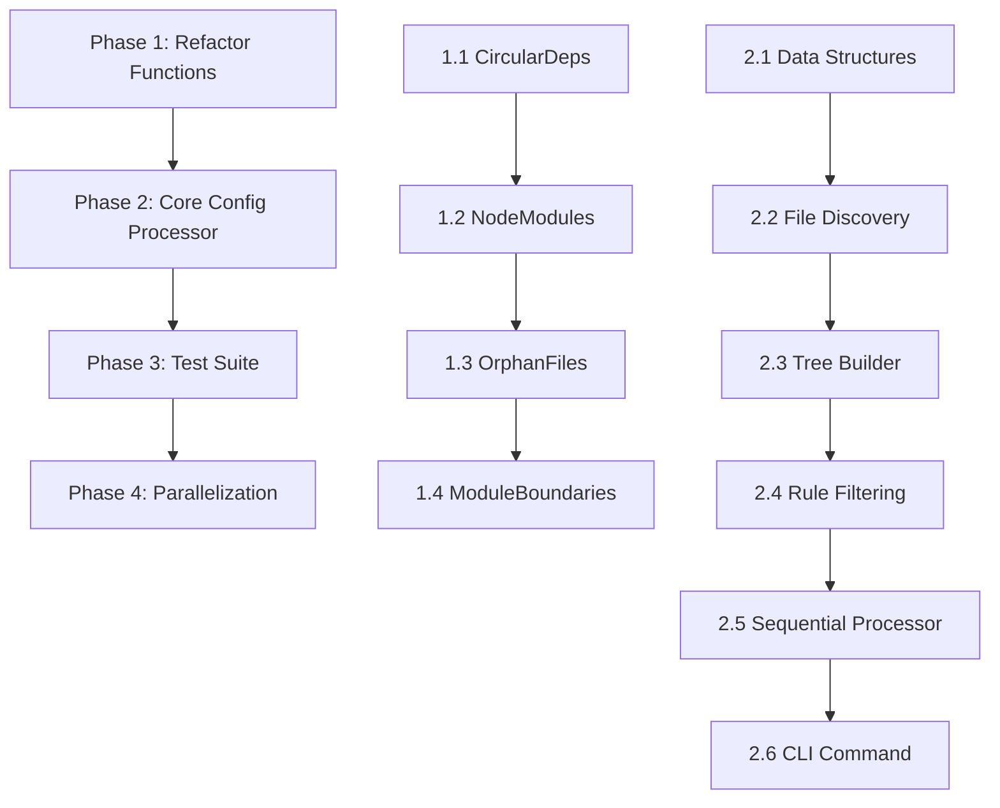

# Config Processing Feature Implementation Plan

This plan outlines the implementation of a unified config processing feature for rev-dep that consolidates multiple checks (module boundaries, circular imports, orphan files, and node modules) into a single config-driven execution.

## Overview

The goal is to create a config processor that:
1. Parses a `rev-dep.config.json` file with global settings and rules
2. Discovers all files once at the project root level for performance
3. Processes each rule by narrowing down files to relevant subsets
4. Executes enabled checks (circular imports, orphan files, module boundaries, node modules) per rule
5. Returns structured results for reporting

---

## Phase 1: Refactor Existing Functions

> [!IMPORTANT]
> After each refactoring step, run `go test ./...` to ensure no regressions.

### 1.1 Refactor `FindCircularDependencies` to Support Type Import Filtering

- [x] **File**: [circularDeps.go](file:///Users/jakubmazurek/Programming/rev-dep/circularDeps.go)
- [x] **Change**: Add an `ignoreTypeImports bool` parameter to `FindCircularDependencies`
- [x] **Logic**: When traversing dependencies in the DFS function, skip dependencies where `dep.ImportKind == TypeImport` if `ignoreTypeImports` is true
- [x] **Signature Change**: 
  ```go
  func FindCircularDependencies(deps MinimalDependencyTree, sortedFilesList []string, ignoreTypeImports bool) [][]string
  ```
- [x] **Update Call Sites**: 
  - [main.go L342](file:///Users/jakubmazurek/Programming/rev-dep/main.go#L342): Update `circularCmdFn` to pass `ignoreType` to the function
- [x] **Run Tests**: `go test -run TestCircular`

### 1.2 Create Pure Functions for Node Modules Detection

Currently `NodeModulesCmd` in [nodeModules.go](file:///Users/jakubmazurek/Programming/rev-dep/nodeModules.go) calls `GetMinimalDepsTreeForCwd` internally. We need to create variants that accept a pre-built tree.

- [x] **File**: [nodeModules.go](file:///Users/jakubmazurek/Programming/rev-dep/nodeModules.go)
- [x] **Create New Function**: `GetUnusedNodeModulesFromTree`
  ```go
  func GetUnusedNodeModulesFromTree(
      minimalTree MinimalDependencyTree,
      packageJsonNodeModules map[string]bool,
      cwd string,
      pkgJsonFieldsWithBinaries []string,
      filesWithBinaries []string,
      filesWithModules []string,
      packageJson string,
      tsconfigJson string,
      modulesToInclude []string,
      modulesToExclude []string,
  ) []string
  ```
  - [x] Extract logic from `NodeModulesCmd` for unused detection
  - [x] Return `[]string` (list of unused modules) instead of formatted string
  
- [x] **Create New Function**: `GetMissingNodeModulesFromTree`
  ```go
  func GetMissingNodeModulesFromTree(
      minimalTree MinimalDependencyTree,
      modulesToInclude []string,
      modulesToExclude []string,
  ) []MissingNodeModuleResult // Define struct with ModuleName, ImportedFrom fields
  ```
  - [x] Extract logic from existing `GetMissingNodeModules`
  - [x] Return structured results instead of printing

- [x] **Define Result Struct**:
  ```go
  type MissingNodeModuleResult struct {
      ModuleName   string
      ImportedFrom []string
  }
  ```

- [x] **Refactor Existing Functions**: Update `NodeModulesCmd` to use the new pure functions internally
- [x] **Run Tests**: `go test -run TestNodeModules`

### 1.3 Create Pure Function for Orphan Files Detection

- [x] **File**: Create new file `orphanFiles.go`
- [x] **Create Function**: `FindOrphanFiles`
  ```go
  func FindOrphanFiles(
      minimalTree MinimalDependencyTree,
      validEntryPoints []string,
      graphExclude []string,
      ignoreTypeImports bool,
      cwd string,
  ) []string
  ```
  - [x] Use `GetEntryPoints` from [getEntryPoints.go](file:///Users/jakubmazurek/Programming/rev-dep/getEntryPoints.go) as base
  - [x] Filter results using `validEntryPoints` patterns (files matching these are valid entry points, not orphans)
  - [x] Apply `graphExclude` patterns by filtering out files from the input list before graph building (graph building will naturally stop when excluded files cannot be discovered)
  - [x] Handle missing file references gracefully during graph traversal (log warning, don't fail)
  - [x] Return list of orphan file paths
  
- [x] **Create Tests**: Add `orphanFiles_test.go` with basic test cases

### 1.4 Refactor Module Boundaries to Accept Pre-built Tree

- [x] **File**: [cmd_module_boundaries.go](file:///Users/jakubmazurek/Programming/rev-dep/cmd_module_boundaries.go)
- [x] **Create New Function**: `CheckModuleBoundariesFromTree`
  ```go
  type ModuleBoundaryViolation struct {
      FilePath   string
      ImportPath string
      RuleName   string
      ViolationType string // "denied" or "not_allowed"
  }
  
  func CheckModuleBoundariesFromTree(
      minimalTree MinimalDependencyTree,
      files []string,
      boundaries []BoundaryRule,
      cwd string,
  ) []ModuleBoundaryViolation
  ```
  - [x] Extract violation checking logic from `moduleBoundariesCmdFn`
  - [x] Return structured results instead of building string report
  
- [x] **Update Existing Function**: Refactor `moduleBoundariesCmdFn` to use `CheckModuleBoundariesFromTree`
- [x] **Run Tests**: `go test -run TestModuleBoundaries`

---

## Phase 2: Implement Config Processing Core

### 2.1 Create Config Processor Data Structures

- [x] **File**: Create new file `configProcessor.go`
- [x] **Define Result Structures**:
  ```go
  type RuleResult struct {
      RulePath                  string
      ModuleBoundaryViolations  []ModuleBoundaryViolation
      CircularDependencies      [][]string
      OrphanFiles               []string
      UnusedNodeModules         []string
      MissingNodeModules        []MissingNodeModuleResult
  }
  
  type ConfigProcessingResult struct {
      RuleResults []RuleResult
      HasFailures bool
  }
  ```

### 2.2 Implement File Discovery

- [x] **Add Function**: `discoverAllFilesForConfig`
  ```go
  func discoverAllFilesForConfig(
      cwd string,
      ignoreFiles []string,
  ) ([]string, []GlobMatcher, error)
  ```
  - [x] Use `GetFiles` from [main.go](file:///Users/jakubmazurek/Programming/rev-dep/main.go) as base
  - [x] Apply `ignoreFiles` patterns from config
  - [x] Always include gitignore patterns via `FindAndProcessGitIgnoreFilesUpToRepoRoot`
  - [x] Return both files list and compiled exclude patterns

### 2.3 Implement Dependency Tree Builder for Config

- [x] **Add Function**: `buildDependencyTreeForConfig`
  ```go
  func buildDependencyTreeForConfig(
      allFiles []string,
      excludePatterns []GlobMatcher,
      conditionNames []string,
      cwd string,
      packageJson string,
      tsconfigJson string,
  ) (MinimalDependencyTree, *ResolverManager, error)
  ```
  - [x] Based on `GetMinimalDepsTreeForCwd` but adapted for config processing
  - [x] Always resolve type imports (we filter later per-check)
  - [x] Always follow monorepo packages
  - [x] Return the `ResolverManager` for node modules information access

### 2.4 Implement Rule File Filtering

- [x] **Add Function**: `filterFilesForRule`
  ```go
  func filterFilesForRule(
      allFiles []string,
      fullTree MinimalDependencyTree,
      rulePath string,
      cwd string,
  ) ([]string, MinimalDependencyTree)
  ```
  - [x] Filter `allFiles` to only include files under `rulePath`
  - [x] Find entry points from filtered files using the full tree
  - [x] Build subset graph using `buildDepsGraphForMultiple` with filtered entry points
  - [x] Use `bst` to get all vertices (files) reachable from those entry points
  - [x] Create a subset of `MinimalDependencyTree` containing only relevant files

### 2.5 Implement Main Config Processor (Sequential)

- [x] **Add Function**: `ProcessConfig`
  ```go
  func ProcessConfig(
      config *RevDepConfig,
      cwd string,
      packageJson string,
      tsconfigJson string,
  ) (*ConfigProcessingResult, error)
  ```
  - [x] **Step 1**: Call `discoverAllFilesForConfig` with `config.IgnoreFiles`
  - [x] **Step 2**: Call `buildDependencyTreeForConfig` to get full tree + resolver manager
  - [x] **Step 3**: For each rule in `config.Rules`:
    - [x] Call `filterFilesForRule` to get rule-specific files and tree subset
    - [x] Execute enabled checks:
      - [x] If `CircularImportsDetection.Enabled`: Call `FindCircularDependencies`
      - [x] If `OrphanFilesDetection.Enabled`: Call `FindOrphanFiles`
      - [x] If `ModuleBoundaries` is not empty: Call `CheckModuleBoundariesFromTree`
      - [x] If `UnusedNodeModulesDetection.Enabled`: Call `GetUnusedNodeModulesFromTree`
      - [x] If `MissingNodeModulesDetection.Enabled`: Call `GetMissingNodeModulesFromTree`
    - [x] Collect results into `RuleResult`
  - [x] **Step 4**: Return `ConfigProcessingResult`

### 2.6 Implement CLI Command for Config Execution

- [x] **Add Command**: `runConfigCmd` in `main.go` or new file `cmd_run_config.go`
  ```go
  var configRunCmd = &cobra.Command{
      Use:   "run",
      Short: "Execute all checks defined in rev-dep.config.json",
      RunE: func(cmd *cobra.Command, args []string) error { ... }
  }
  ```
  - [x] Auto-discover config in current working directory (no `--config` flag needed)
  - [x] Use process working directory (no `--cwd` flag needed)
  - [x] Output human-readable report format (no `--json` flag needed)
  - [x] Call `ProcessConfig` and format/print results

---

## Phase 3: Test Suite for Config Processor

### 3.1 Create Test Fixture Project

- [x] **Directory**: Create `__fixtures__/configProcessorProject/`
- [x] **Structure**:
  ```
  __fixtures__/configProcessorProject/
  ├── rev-dep.config.json
  ├── package.json
  ├── tsconfig.json
  ├── src/
  │   ├── index.ts          # Main entry point
  │   ├── utils/
  │   │   ├── helper.ts     # Regular utility
  │   │   └── orphan.ts     # Orphan file (not imported)
  │   ├── features/
  │   │   ├── featureA.ts   # Has circular dep with featureB
  │   │   └── featureB.ts   # Has circular dep with featureA
  │   └── boundary/
  │       ├── public.ts     # In public boundary
  │       └── private.ts    # In private boundary, should not be imported from public
  └── packages/
      └── subpkg/
          ├── package.json
          ├── src/
          │   └── index.ts
          └── rev-dep.config.json  (optional, for sub-package rules)
  ```

### 3.2 Create Config Processing Tests

- [x] **File**: Create `configProcessor_test.go`
- [x] **Test Cases**:
  - [x] `TestConfigProcessor_CircularDependencies`: Verify circular deps are detected
  - [x] `TestConfigProcessor_OrphanFiles`: Verify orphan files are detected
  - [x] `TestConfigProcessor_ModuleBoundaries`: Verify boundary violations are detected
  - [x] `TestConfigProcessor_UnusedNodeModules`: Verify unused modules are detected
  - [x] `TestConfigProcessor_MissingNodeModules`: Verify missing modules are detected
  - [x] `TestConfigProcessor_MultipleRules`: Verify multiple rules process correctly
  - [x] `TestConfigProcessor_RulePathFiltering`: Verify files are correctly scoped to rule paths

### 3.3 Test Commands

```bash
# Run all config processor tests
go test -v -run TestConfigProcessor

# Run all tests including smoke tests
go test -v ./...
```

- [x] Commands run successfully (some tests need refinement but infrastructure is in place)

---

## Phase 4: Parallel Processing

### 4.1 Parallelize Rule Processing

- [x] **File**: `configProcessor.go`
- [x] **Add Function**: `ProcessConfig`
  ```go
  func ProcessConfig(
      config *RevDepConfig,
      cwd string,
      packageJson string,
      tsconfigJson string,
  ) (*ConfigProcessingResult, error)
  ```
  - [x] Use goroutines for each rule with a WaitGroup
  - [x] Use mutex/channel for collecting results
  - [x] Preserve order of results to match rule order

### 4.2 Parallelize Checks Within Rules

- [x] **Update**: Within each rule processing:
  - [x] Run all enabled checks in parallel using goroutines
  - [x] Each check writes to its own result field (no shared state conflicts)
  - [x] Wait for all checks to complete before moving to next rule

### 4.3 Thread Safety Verification

- [x] **Verify**: Ensure `MinimalDependencyTree` is read-only during parallel processing
- [x] **Verify**: Ensure `ResolverManager` methods are thread-safe or create per-goroutine copies
- [x] **Add Tests**: Run tests with `-race` flag
  ```bash
  go test -race -v -run TestConfigProcessor
  ```

---

## Verification Plan

### Automated Tests

| Test Area | Command | Expected Outcome |
|-----------|---------|------------------|
| All unit tests | `go test -v ./...` | All tests pass |
| Race detection | `go test -race -v ./...` | No race conditions |
| Config processor tests | `go test -v -run TestConfigProcessor` | All processor tests pass |
| Circular deps tests | `go test -v -run TestCircular` | Tests pass including ignoreTypeImports |
| Module boundaries tests | `go test -v -run TestModuleBoundaries` | Tests pass with refactored function |

### Manual Verification

1. **Create a test config** at project root:
   ```json
   {
     "configVersion": "1.0",
     "ignoreFiles": ["**/*.test.ts"],
     "rules": [{
       "path": ".",
       "circularImportsDetection": { "enabled": true },
       "orphanFilesDetection": { "enabled": true, "validEntryPoints": ["*.config.*"] }
     }]
   }
   ```

2. **Run the new command**:
   ```bash
   go build && ./rev-dep config run
   ```

3. **Verify output** contains detected issues categorized by rule

---

## File Changes Summary

| File | Change Type | Description |
|------|-------------|-------------|
| [circularDeps.go](file:///Users/jakubmazurek/Programming/rev-dep/circularDeps.go) | MODIFY | Add `ignoreTypeImports` parameter |
| [nodeModules.go](file:///Users/jakubmazurek/Programming/rev-dep/nodeModules.go) | MODIFY | Add pure functions for tree-based detection |
| [cmd_module_boundaries.go](file:///Users/jakubmazurek/Programming/rev-dep/cmd_module_boundaries.go) | MODIFY | Add pure function returning structured violations |
| `orphanFiles.go` | NEW | Orphan files detection logic |
| `configProcessor.go` | NEW | Core config processing logic with parallel processing |
| `cmd_run_config.go` | NEW | CLI command for running config |
| `configProcessor_test.go` | NEW | Test suite for config processor |
| `configProcessor_parallel_test.go` | NEW | Test comparing sequential vs parallel results |
| `__fixtures__/configProcessorProject/` | NEW | Test fixture project |
| [main.go](file:///Users/jakubmazurek/Programming/rev-dep/main.go) | MODIFY | Update `circularCmdFn` call site, register new command |

---

## Order of Implementation



> [!TIP]
> Each section in Phase 1 should be completed with tests passing before moving to the next. This ensures the building blocks are solid before integration.
